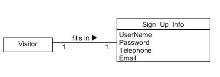
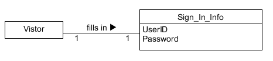
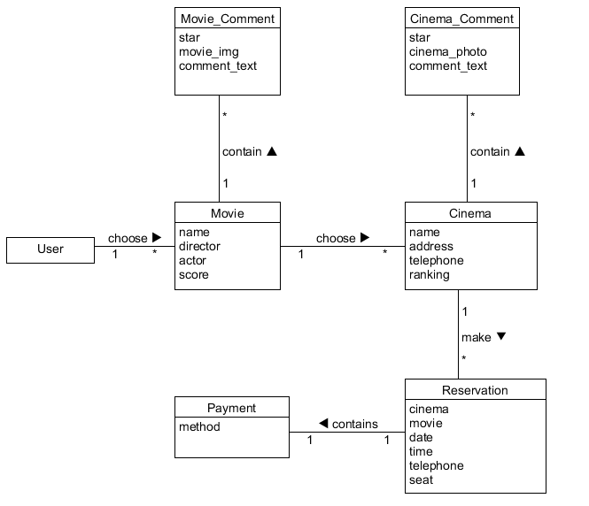
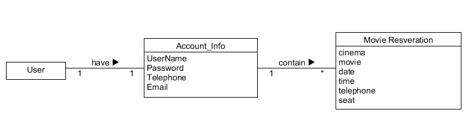

# Domain Model
首先我们回顾一下之前的用例模型

因此我们对以下四个基本用例进行领域建模
- 注册
- 登陆
- 购票
- 查看已购电影
- 查看个人信息
### 注册 功能的领域建模如下图所示
  
注册信息Sign_Up_Info包括：用户名、密码、电话、邮箱

### 登陆 功能的领域建模如下图所示
  
登陆信息Sign_In_Info包括：用户ID、密码

### 购票 功能的领域建模如下图所示
  
电影Movie，包括：电影的名字、导演、演员、评分
电影评价Movie_Comment，包括：评星、电影图片、文字评论、综合分数
一部电影包含多条电影评论，而一条电影评论仅对用于一部电影

电影院Cinema，包括：电影院的名字、地址、电话、等级
电影院评价Cinema_Comment，包括：评星、电影院的照片、文字评论
一个电影院包含多条电影院评论，而一条电影院评论仅对用于一个电影院

预约信息Reservation，包括：电影院的名字、电影的名字、日期、时间、手机号、座位

用户在选择电影及电影院之后，填写预约，自主选择支付方式，支付成功后，即成功得购买了电影票。

### 查看个人信息 和 查看已购电影 功能的领域建模如下图所示
  
个人账户信息Account_Info与注册填写的信息一致，包括：用户名、密码、电话、邮箱
除此之外，还可以查看到电影的购票信息，包括：电影院的名字、电影的名字、日期、时间、手机号、座位
一个用户对应一个账号，而一个账号对应多次的电影购票。

因此，领域模型如下图所示：

