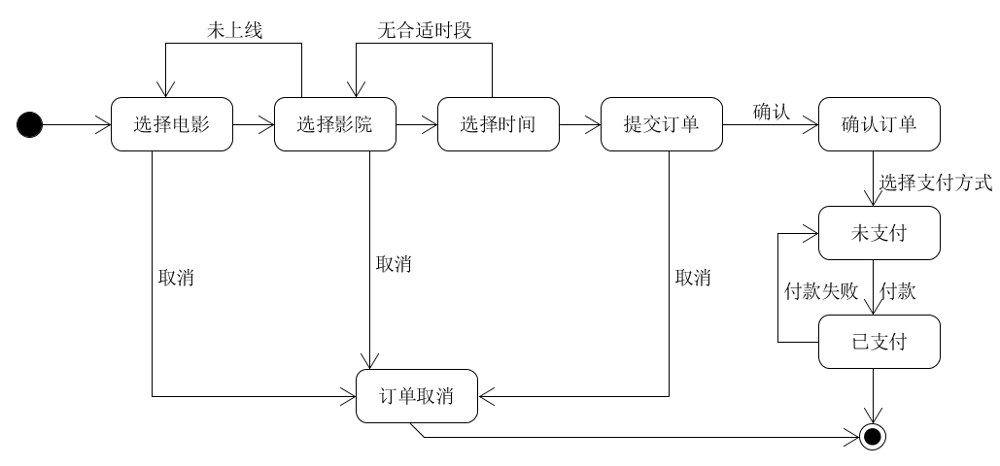

# 6.4 State Model

## 状态建模简述

应用场景：

- 需求建模。 与客户讨论关键事物的变化过程。 进一步细化 用例图 或 用例场景。
- OOD/P 软件设计。 关键数据的变化；表达状态机；状态机模式（GOF）

工作步骤：

- 确定研究对象
    - 这是最难的！系统作为一个对象？所有对象？
    - 通常是客户关注的业务交易实体，如订单，凭证等
    
- 识别状态集合
    + I， F， S={S0...Sk}
    + 状态不一定是门的开或关闭这样简单属性，可能是属性复杂的组合
    + 事物中包含的 mode 和 state 属性

- 识别事件和变迁条件

- 合理性、完整性检查与逻辑分析
    - 终点的可达性
    - 悬挂状态
    - 循环分析（死循环条件与风险）
    - 路径分析（最短路径、关键路径、平均距离）

## 互联网电影购票系统状态建模

购票：

