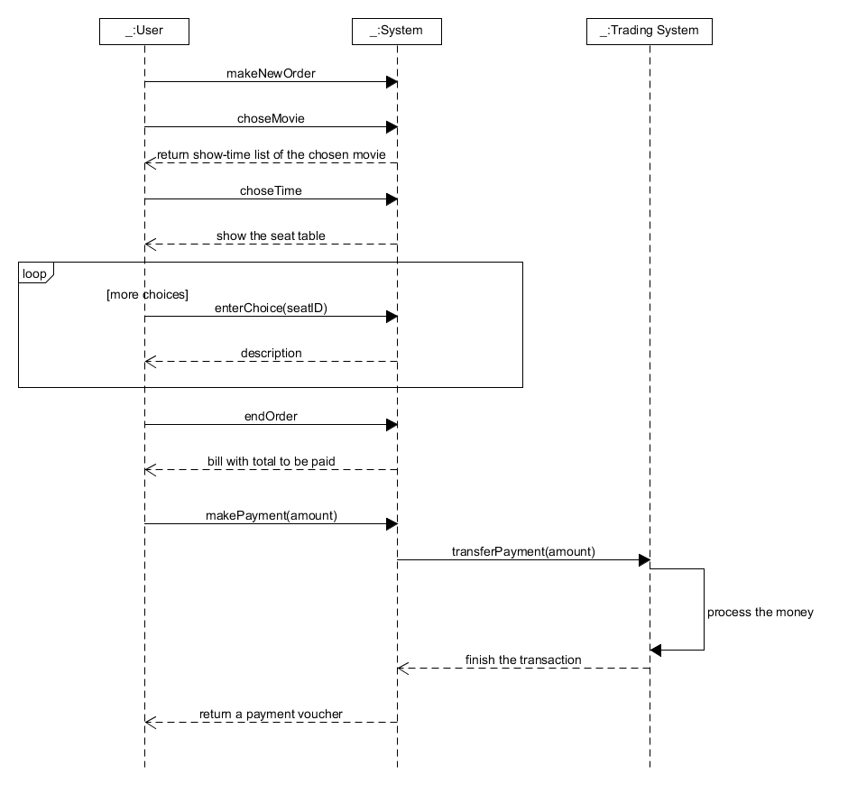
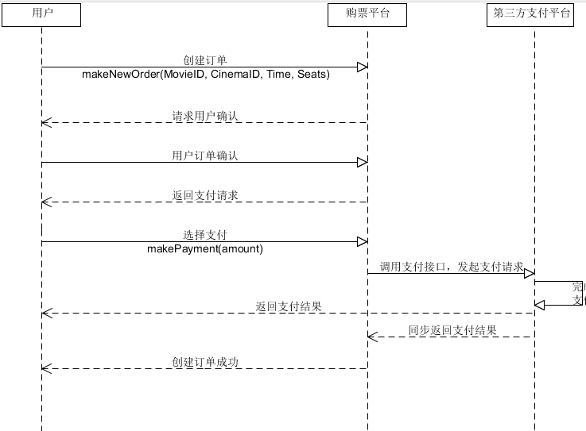
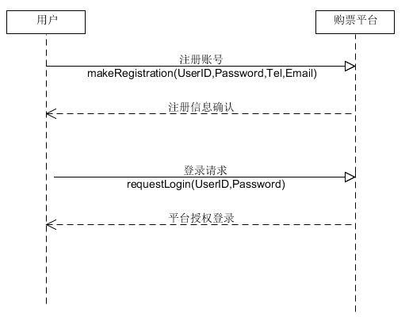
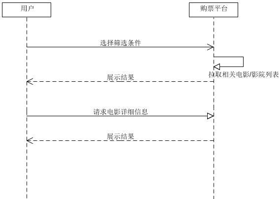
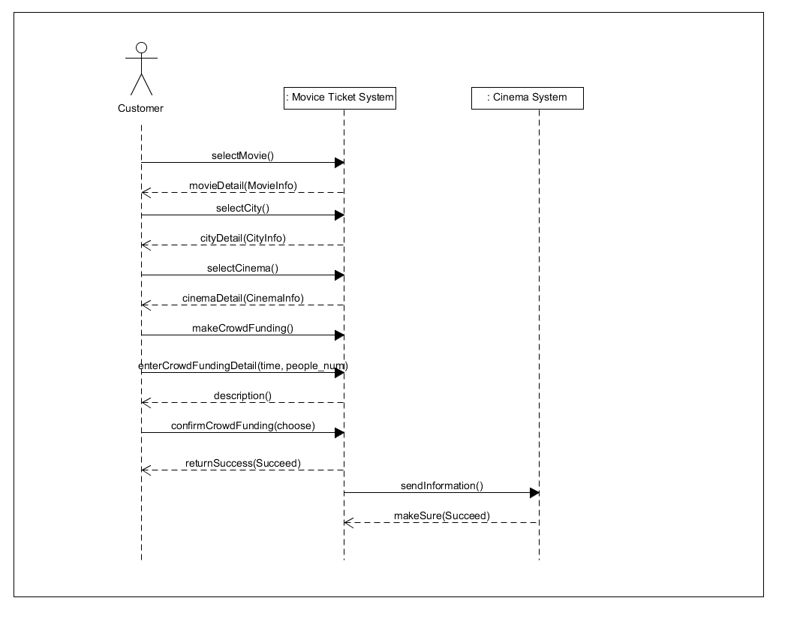

# 系统顺序图 
-----
* 每个成员至少编写一个应用场景的系统顺序图（左用户，中间是系统，右边是外部实体对象）
* 至少一个操作需要写后置条件，用注释符号表示
* 请使用自己 git 账号体完成该任务（同时在文字中标明自己的学号）

### 15331406:

**应用场景：客户下单购票**

###15331401：

**应用场景：客户下单购票**

**应用场景：登录注册**

**应用场景：选择影院/电影**

### 15331398:
**应用场景:评论/点赞评论**

### 15331416：
**应用场景:小食预订**

#### 契约CO1：makeNewOrder
操作： makeNewOrder()

交叉引用：用例：小食预订

前置条件： 无

后置条件： 

- 创建了Order的实例o（创建实例）
- o被关联到Register(形成关联)
- o的属性被初始化（修改属性）

#### 契约CO2: enterItem

操作： enterItem(itemID: ItenID, quantity: Interger)

交叉引用：用例：小食预订

前置条件：正在进行的小食预订

后置条件： 

- 创建了OrderLineItem的实例oli（创建实例）
- oli被关联到当前Order(形成关联)
- sli.quantity赋值为quantity（修改属性）
- 基于itemID的匹配，oli被关联到ProductDescription（形成关联）

#### 契约CO3: endOrder

操作： endOrder()

交叉引用：用例：小食预订

前置条件：正在进行的小食预订

后置条件： 

- Order.isComplete被置为真（修改属性）

#### 契约CO4: makePayment

操作： makePayment(amount:Money)

交叉引用：用例：小食预订

前置条件：正在进行的小食预订

后置条件： 

- 创建了Payment的实例p（创建实例）
- p.amountTendered被赋值为amount（修改属性）
- p被关联到当前的Order（形成关联）

#### 契约CO5: confirmOrder

操作： confirmOrder()

交叉引用：用例：小食预订

前置条件：正在进行的小食预订

后置条件： 

- Order.isConfirm被置为真（修改属性）

=======
### 15331397:   
**应用场景：众筹旧电影**

**操作协议**
- 操作：makeCrowdFunding()
- 交叉引用：用例：众筹旧电影
- 前置条件：用户必须已经登陆
- 后置条件：系统成功帮用户创建一个众筹旧电影请求

- 操作：sendInformation()
- 交叉引用：用例：众筹旧电影
- 前置条件：接受消息的电影院支持该电影购票系统
- 后置条件：系统成功向电影院发送一个订单消息

