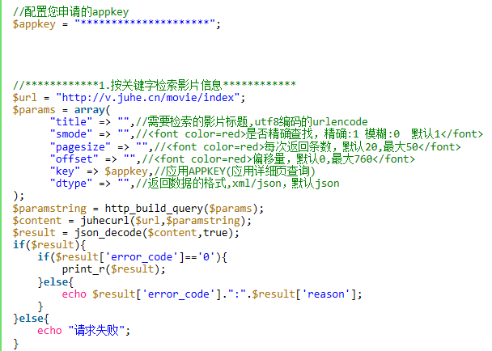
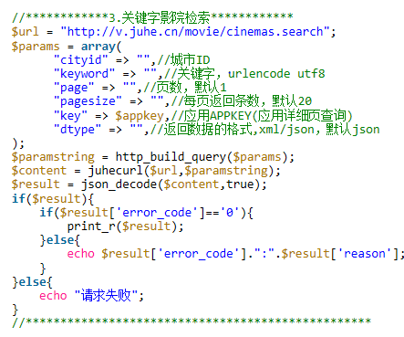

# API设计

参考[微信支付API](https://pay.weixin.qq.com/wiki/doc/api/app/app.php?chapter=9_1 "微信支付API")给出部分正式的API说明书

### 按关键字检索影片信息

#### 应用场景
用户在搜索框输入想要搜索的内容，售票系统调用接口在数据库中查找相关的影片信息
#### 请求参数

| 字段名 | 变量名 | 必填 | 类型 | 示例值 | 描述 |
| :---: | :---: | :---: | :---: | :---: | :---: |
| 检索内容 | title | 是 | string | 哈利波特 | 需要检索的影片标题，UTF8编码的url encode |
| 查找要求 | smode | 否 | int | 0 | 是否实施精确查找，精确查找（默认）：1；模糊查找：0 |
| 返回条数 | pagesize | 否 | int | 13 | 搜索完成后返回多少条结果，默认20，最大50 |
| 返回数据格式 | dtype | 否 | string | json | 格式可以为json或xml，默认为json |
| 偏移 | offset | 否 | int | 32 | 偏移，0~600 |
| key | key | 是 | string |  | 应用APPKEY(应用详细页查询) |

#### 返回参数

| 字段名 | 变量名 | 类型 | 示例值 | 描述 |
| :---: | :---: | :---: | :---: | :---: |
| 返回码 | resultcode | int | 200 |  |
| 返回说明 | reason | string | 成功返回 | 对于返回码的一个说明 |
| 返回结果集 | result | Array |  | 一个数组集合，数组内各元素是搜索得到的结果对象 |
| 错误码 | errorcode | int | 0 |  |

对于结果数组内得到的影片对象，其内部参数列表如下：

| 字段名 | 变量名 | 类型 | 示例值 | 描述 |
| :---: | :---: | :---: | :---: | :---: |
| ID | movieid | string | "10641" | 影片的唯一标识符 |
| 演员列表 | actors | string | 马修·布罗德里克 Matthew Broderick,让·雷诺 Jean Reno,玛丽亚·皮提罗 Maria Pitillo | 参演的演员列表 |
| 名字 | title | string | Hamlet | 影片名称 |
| 别名 | also_known_as | string | 哈姆雷特 | 影片的其他名称 |
| 得分 | rating | string | "7.5" | 影片的评分 |
| 分类 | genres | string | 戏剧，战争 | 影片的标签 |
| 时长 | runtime | string | "140 min" | 影片时长 |
| 语言 | language | string | English | 影片的对白使用的语言 |
| 海报 | poster | string | http://v.juhe.cn/movie/img?5146 | 影片海报资源所在的URL |
| 编剧列表 | writers | string | 迪安·德夫林 |  |
| 拍摄地 | film_locations | 美国，英国 |  | 影片取景地点 |
| 导演列表 | directors | string | 迪安·德夫林 |  |
| 评分人数 | rating_count | string | "4821" | 为影片打分的人数 |
| 剧情概要 | plot_simple | string |  |  |
| 拍摄时间 | year | string | "1998" |  |
| 拍摄国家 | country | string | 英国 |  |
| 上映时间 | release_date | string | "19980813" |  |

示例调用代码如下所示： 

### 检索周边影院

#### 应用场景

用户查找指定经纬度位置周围一定半径范围内的影院

#### 请求参数

| 字段名 | 变量名 | 必填 | 类型 | 示例值 | 描述 |
| :---: | :---: | :---: | :---: | :---: | :---: |
| 纬度 | lat | 是 | string | "20" | 指定位置的纬度 |
| 经度 | lon | 是 | string | "20" | 指定位置的经度 |
| 半径 | radius | 是 | string | "500" | 搜索影院的搜索半径，最大允许3000米半径范围的搜索 |
| key | key | 是 | string |  | 应用APPKEY(应用详细页查询) |
| 返回数据格式 | dtype | 否 | string | json | 格式可以为json或xml，默认为json |

#### 返回参数

| 字段名 | 变量名 | 类型 | 示例值 | 描述 |
| :---: | :---: | :---: | :---: | :---: |
| 返回码 | resultcode | int | 200 |  |
| 返回说明 | reason | string | 成功返回 | 对于返回码的一个说明 |
| 返回结果集 | result | Array |  | 一个数组集合，数组内各元素是搜索得到的结果对象 |
| 错误码 | errorcode | int | 0 |  |

对于结果数组内得到的影院对象，其内部参数列表如下：

| 字段名 | 变量名 | 类型 | 示例值 | 描述 |
| :---: | :---: | :---: | :---: | :---: |
| ID | id | string | "10641" | 影院的唯一标识符 |
| 城市 | cityName | string | 广州 | 影院所在城市名字 |
| 影院名 | cinemaName | string | 万象影城 | |
| 地址 | address | string | XX区XX路XX号 | 影院所在的精确地址描述 |
| 联系方式 | phone | string | "14322534421" | 影院联系电话 |
| 纬度 | lat | string | "36" | 影院地址的纬度 |
| 经度 | lon | string | "28" | 影院地址的经度 |
| 距离 | distance | string | "342.3" | 影院位置与搜索起点直接的距离 |

示例调用代码如下所示： 

#### 设定的错误代码

| 错误码 | 说明 |
| :---: | :---: |
| 204201 | 影片标题不能为空 |
| 204202 | 查询失败 |
| 204203 | 查询不到相关记录 |
| 204204 | 城市ID错误 |
| 204205 | 错误的经纬度 |
| 204206 | 错误的电影院ID |
| 204207 | 查询的电影院不存在 |
| 204208 | 错误的电影ID |
| 10001 | 错误的请求KEY |
| 10002 | 该KEY无请求权限 |
| 10003 | KEY过期 |
| 10004 | 错误的OPENID |
| 10005 | 应用未审核超时，请提交认证 |
| 10007 | 未知的请求源 |
| 10008 | 被禁止的IP |
| 10009 | 被禁止的KEY |
| 10011 | 当前IP请求超过限制 |
| 10012 | 请求超过次数限制 |
| 10013 | 测试KEY超过请求限制 |
| 10014 | 系统内部异常 |
| 10020 | 接口维护 |
| 10021 | 接口停用 |

