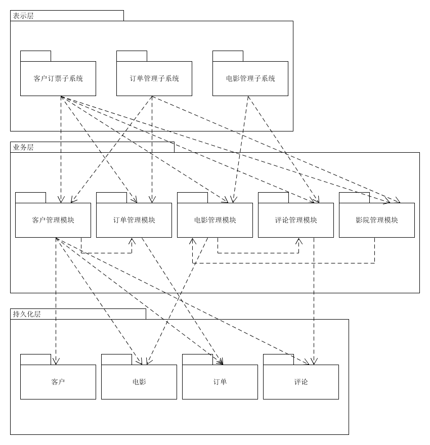
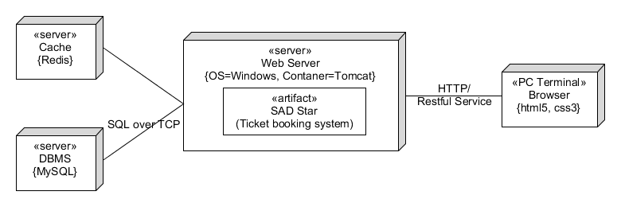

# 软件架构文档

## 简介

### 目的

本文档使用多个体系结构视图来描述系统的多个方面，对系统进行了全面的体系结构概述，用于就并表述对系统的架构作出的重要决策。

### 范围

本文档用于SAD star小组正在开发中的Star Tickets电影购票系统。Star Tickets是为用户提供电影购票服务的Web应用系统，提供电影订票、电影评价、电影众筹等功能。

### 定义、首字母缩写词和缩略语
见系统术语表

### 参考资料

1. 系统前景文档，1.0版
2. 系统软件需求文档，1.0版
3. 补充规格说明，1.0版
4. 用例报告，1.0版
5. 领域模型，1.0版
6. 系统软件开发计划，1.0版
7. 系统迭代计划文档，1.0版
8. RUP的软件架构文档模板，1.0版

### 概要
本软件体系结构文档的其余部分包含体系结构表示，目标和约束条件。 该文件还提供了架构因素表和相应的解决方案。 然后文档列出了不同体系结构视图，并详细描述了系统的不同方面。

## 架构表示方式

本文档主要通过两个视图来表示时光电影订票系统的软件架构：

- 逻辑视图：当采用面向对象的设计方法时，逻辑视图即对象组织模型，通常用包图表示。 

- 物理视图：描述软件如何映射到硬件，反映系统设备或制品在分布方面的设计，通常用部署图表示。

## 架构目标和约束
一些关键要求和系统约束对架构有重大影响，如下所示：
1. 系统在开发过程中，采用前后端分开开发模式
2. 后端开发语言主要为Python，采用关系型数据库存放数据，采用基于UML的面向对象分析与设计方法进行开发
3. 团队中只有一台服务器
4. 服务器端必须能在Linux上运行
5. 电影订票系统可以在主流浏览器上正确呈现
6. 所有用户在保证网络连接的情况下可同时通过局域网和互联网访问系统
7. 系统必须保证数据的安全访问，用户需要通过用户名和密码进行身份认证

## 架构因素及解决方案

### 架构因素表

| 因素   | 度量和质量场景 | 可变性（当前的灵活性和未来的演化性） | 该因素（及其变化）对利益相关者，体系结构和其他因素的影响 | 成功的优先级 | 困难或风险 |
| ------ | -------------- | ------------------------------------ | -------------------------------------------------------- | ------------ | :--------: |
| **安全性**                                                                                                                                       ||||||
| 操作约束 | 任何用户不得超出他/她的权限范围进行操作 | 当前的灵活性——没有。严格禁止越权操作。演化性——没有 |  对系统规模设计有重要影响。如果不同用户的权限没有严格控制，系统将会一团混乱                                                        | H | M |
| **易用性** |                |                                      |                                                          |              |            |
| 通知机制 | 用户能通过网站的指引，顺利得实现电影购票、电影评论、电影众筹等功能性需求 |当前的灵活性——没有。演化型——没有                                      | 便于用户使用，对设计影响较小 | M | M |
| **可靠性及可恢复性** | | | | | |
| 从远程服务失败中恢复 |当远程服务访问失败时，在生产环境、正常负荷情况下，在一分钟内如果检测到其恢复，则重新建立连接 |当前的灵活性——SME认为在能够重新建立连接之前，Web应用端的简化服务是可以接受的|对大型设计有较大影响，用户反感订票失败、服务终端等情况 |H |M |

### 架构因素的解决方案

- 问题：可靠性——从创建订单服务失败中恢复
- 解决方案概要：考虑不同场景下的错误恢复，使用本地服务中的错误恢复机制实现故障转移
- 因素
1.  在使用外部服务（如支付授权）时出现错误的健壮恢复
2.  在请求远程数据库数据失败时的健壮恢复
- 解决方案
1.  重复请求：幂等控制(一个操作，不论执行多少次，产生的效果和返回的结果都是一样的)，如，在第二次支付前提示第一次支付成功，阻止重复支付；
2.  预扣减库存失败：预创建订单过程中，库存数量变化导致创建失败，订单由定时补偿机制定时删除
3.  订单创建消息发送失败：由于服务/资源响应超时、处理中断等原因导致订单数据同步失败，库存服务定时轮询处理数据(需要考虑事务处理时间,将超过某个时间范围该事务还处于预处理状态的订单筛选出来),询问订单服务改订单Id对应的订单是否创建成功,根据订单创建成功与否选取相应的事务补偿机制
4.  订单实际创建失败：订单的预处理数据通过订单的定时补偿机制删除，提示用户下单失败，系统同步订单数据，如果已支付进行自动退款处理
- 动机：在购票系统中，订单创建过程可能出现各种失败场景，要保证系统在高并发条件下能正确处理预定支付数据，防止系统崩溃
- 未解决问题：无
- 其他可供选择的方案：购买远程信用授权付的金牌质量服务协议来提高可靠性。可行，但过于昂贵。

---

- 问题：法律——遵守支付授权服务协议
- 解决方案概述：信用卡和借记卡支付处理
- 因素
当支付授权服务批准了信用卡或借记卡支付手，将由支付授权服务而不是买方来负责对卖方的支付。因此此对于每笔支付，卖方都需要将授权服务的未付金额记录于其应收账户下。通常，授权服务在每晚执行电子转账操作，将卖方当天的应收总额转入其账户下，同时对每笔交易扣除（少量的）服务费。
- 动机：
在销售交易中必须遵从所有税务规则。
- 未解决问题：
无
- 其他方案：
无

## 逻辑视图

## 物理视图
描述软件如何映射到硬件，反应系统如何分布方面的设计，主要是关注目标程序及依赖的运行库和系统软件如何的安装和部署到物理机器，以及如何部署机器和网络来配合软件系统的可靠性、可伸缩性等要求。

我们的项目规模较小功能简单，所以物理视图也很简单

