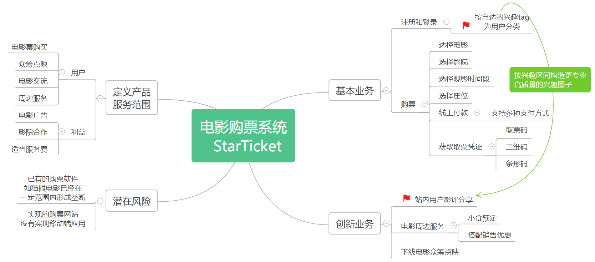
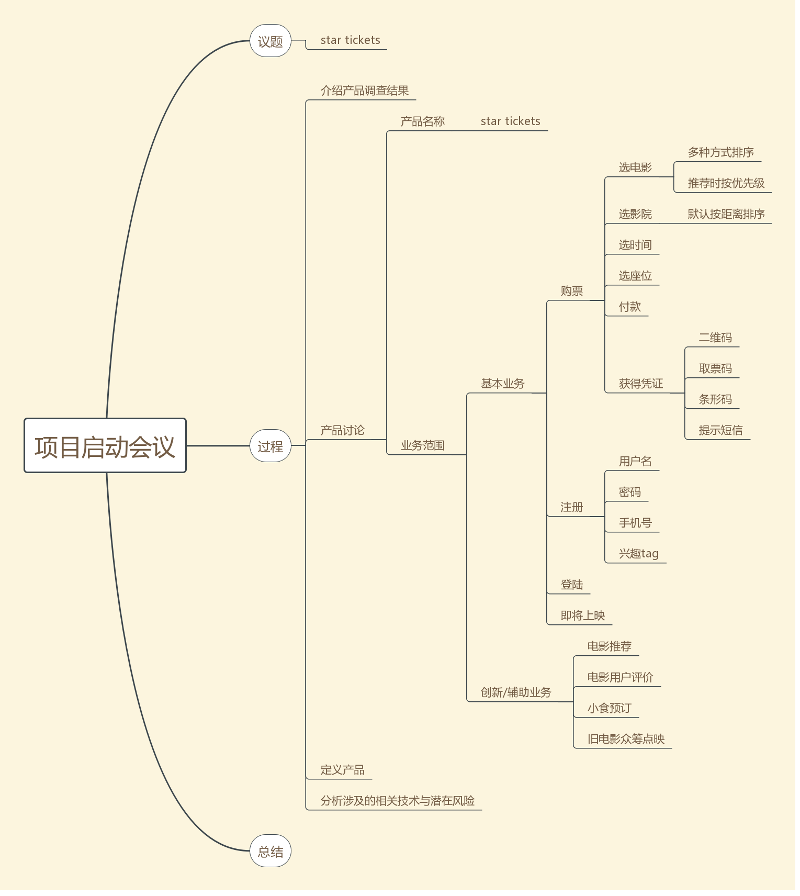
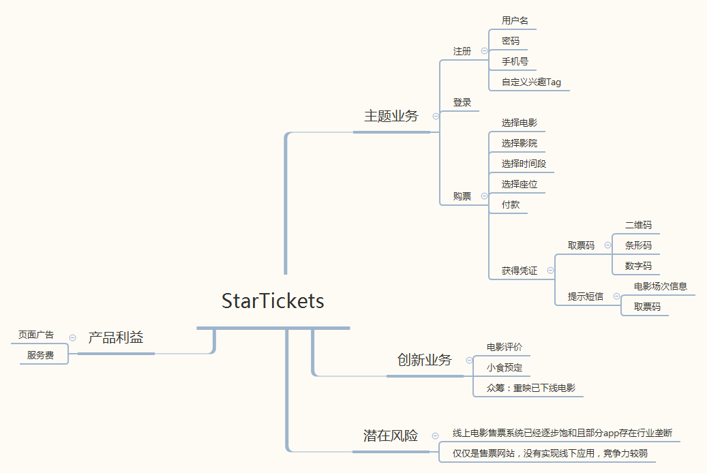
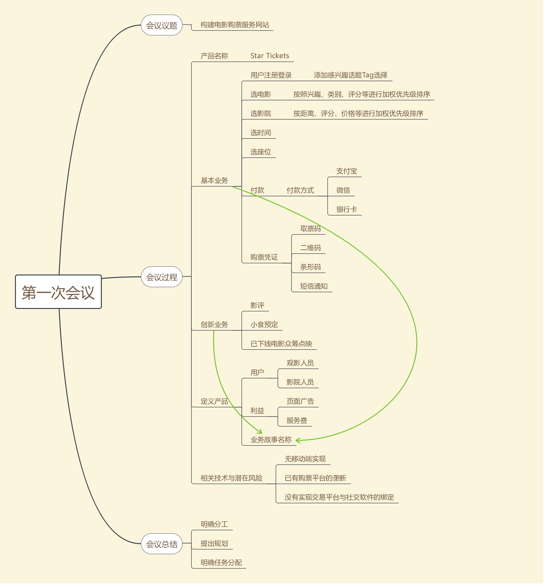
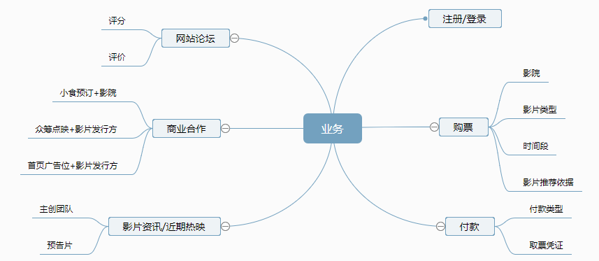
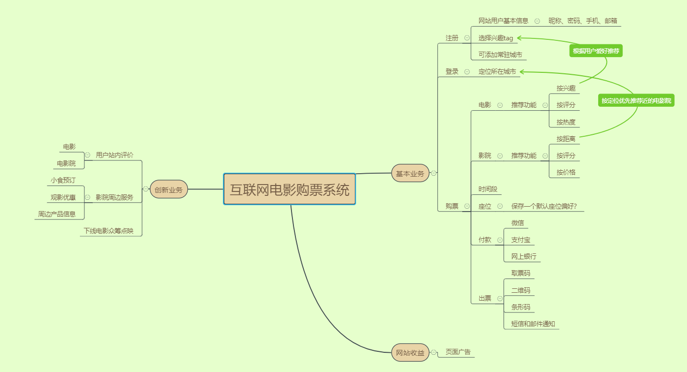
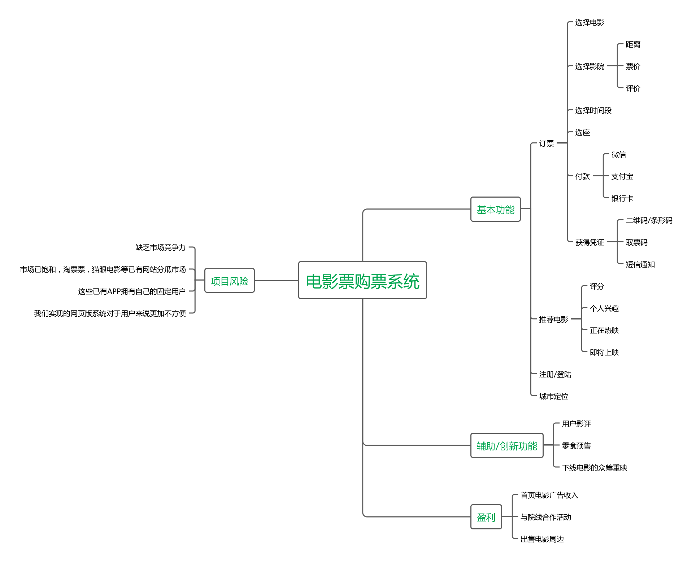

# 项目启动会议

## 会议目标：定义产品范围、愿景和核心业务

## 任务1：介绍产品调查结果

在[项目前期调研](/Inception/Investigation.md)过程中有这一部分的详细介绍。

## 任务2：产品讨论 

> 后续任务都包含在了思维导图内作为会议内容在此处展示

赵不听（15331416）：

ZMJ(15331398)：

二师兄（15331397）：

音(15331406)

小皮筋（15331401）

宁一(15331449)

谷沽呱(15331367)

## 任务3：定义产品

按用户，利益、业务故事名称定义产品的服务范围（6~8个业务）
本步骤的目标，方便编写第一版本 backlog 文档。 具体参考 硝烟中的Scrum和XP

详见任务2中小组成员思维导图

## 任务4：分析涉及的相关技术与潜在风险

详见任务2中小组成员思维导图

## 任务5：项目经理总结陈词

本次会议准备充分，进行顺利，分工明确，会议成效较好。

小组成员根据本周的任务决定了讨论的内容：

- 确定了本周工作任务

    小组需要完成作业要求的markdown文件的填写，涉及：

    + 项目规划（会议最后讨论得出）
    + 前期调研（产品调查报告）
    + 产品特性
    + 会议记录（按流程进行会议的过程时完成草稿，重点是思维导图）
    + 团队组建（大家的职责分工）
    + 项目愿景（从会议中【产品讨论】阶段得出结果）

- 项目启动会议流程

    + 任务1：介绍产品调查结果
    + 任务2：产品讨论
    + 任务3：定义产品
    + 任务4：分析涉及的相关技术与潜在风险
    + 任务5：项目经理总结陈词

- 关于项目规划的完成

    因为组内同学缺乏项目经验，讨论决定参考作业要求中示例的内容为本组制定计划。

# Iteration 1 meeting (18/03/29)
## 会议目标
确定本次迭代的目标，进行任务分工。
## 迭代目标
- 完善需求分析
- 完成原生UI设计
- 学习Python+Flask+Bootstrap+mongoDB的使用
- 进行购票功能原型开发、Web接口开发以及数据库设计
## 任务分工
- 后端 ： ZMJ（15331398）、音（15331406）
- 前端 ： 谷沽呱（15331367）、小皮筋（15331401）
- 分布式部署 ： 二师兄（15331397）
- 静态文件服务 ： 宁一（15331449）、赵不听（15331416）
## 迭代时长
4周 （18/03/29-18/04/26）

# Iteration 2 meeting (18/04/26)
## 会议目标
讨论并解决在上次迭代质量中存在的问题，从而在后续的迭代中提升迭代质量；
确定本次迭代的目标，进行任务分工。
## 上次迭代问题
分工不够明确，
文件命名不统一
## 迭代目标
- 解决上次迭代中出现的问题
- 完善需求分析
- 优化UI设计
- 继续进行购票功能原型开发、Web接口开发以及数据库设计
## 任务分工
- 后端 ： ZMJ（15331398）、音（15331406）
- 前端 ： 谷沽呱（15331367）、小皮筋（15331401）
- 分布式部署 ： 二师兄（15331397）
- 静态文件服务 ： 宁一（15331449）、赵不听（15331416）
## 迭代时长
4周 （18/04/26-18/05/24）
