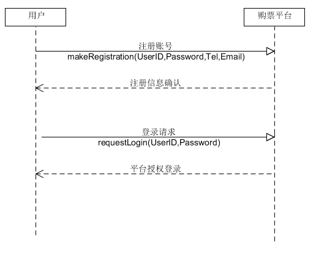
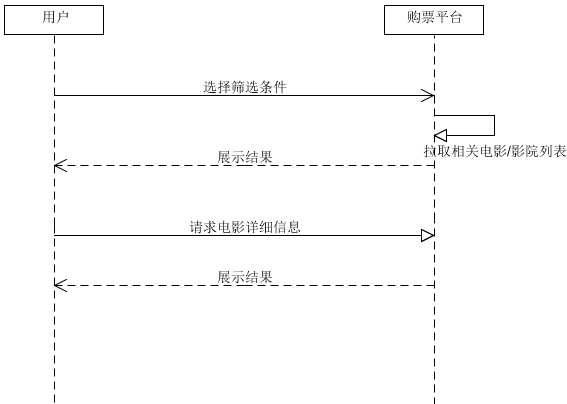

# 系统顺序图 
-----
* 每个成员至少编写一个应用场景的系统顺序图（左用户，中间是系统，右边是外部实体对象）
* 至少一个操作需要写后置条件，用注释符号表示
* 请使用自己 git 账号体完成该任务（同时在文字中标明自己的学号）

### 15331406:

**应用场景：客户下单购票**

###15331401：

**应用场景：客户下单购票**

**应用场景：登录注册**

**应用场景：选择影院/电影**

### 15331398:
**应用场景:评论/点赞评论**

