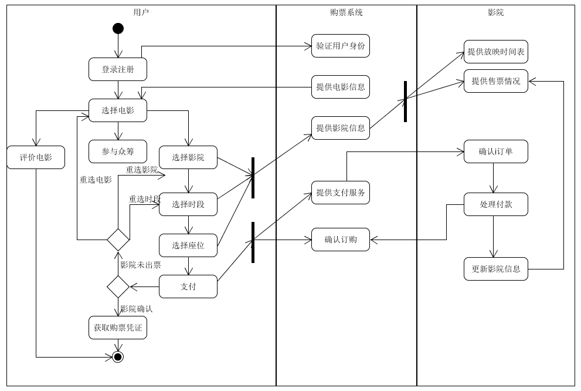

# 6.2 Use Cases

## 1. 完整的用户目标级别用例

参照教程给出的full用例例子，编写了电影票售票系统的一个用户目标级别用例。

----
- 范围：电影票售票系统
- 级别：用户目标
- 主要参与者：购票者
- 涉众及其关注点：
	- 购票者：希望能够更加方便、便宜、快速地买到想要看的电影票，避免去电影院排队买票。希望能够方便的浏览最近的电影上映信息
	- 广告商：希望能够通过在售票系统上的广告投放，让更多潜在用户了解它们，达到比较好的宣传效果
	- 影院：希望通过在售票网站上卖票，提高电影票和小吃销量，赚取更多的利润
	- 支付授权服务：希望接收到格式和协议正确的数字授权请求。希望准确计算用户的应付款
- 前置条件：售票系统得到了影院授权，而电影的上映授权一般是影院自己获取的
- 成功保证：记录购票信息，影院生成相应售票记录并更新状态，用户获得购买凭证（二维码等）
- 主成功场景： 
&emsp;1. 用户登陆账号 
&emsp;2. 用户挑选一部正在上映的电影 
&emsp;3. 系统根据用户所处地理位置为用户推荐影院 
&emsp;4. 用户挑选一家影院 
&emsp;5. 系统筛选出这家影院关于这部电影的排片信息 
&emsp;6. 用户挑选一个观影时间段 
&emsp;7. 用户从剩余的座位中挑一个或若干个座位 
&emsp;8. 用户选择一种支付方式支付 
&emsp;9. 系统通过与支付授权平台的交互，完成从用户端扣费功能，并通知相应影院生成售票记录，更新售票记录 
&emsp;10. 用户付款成功，并获得购票凭证，到时候就可以凭此凭证进入影院观影 
- 扩展（或替代流程）: 
&emsp;A. 用户未登陆：当用户未登陆，就无法进入购票流程正常购票。 
&emsp;&emsp; 1. 进入购票流程（点击购票按钮）时，系统检测是否是登陆状态 
&emsp;&emsp; 2. 当检测到未登陆，跳转到登陆/注册界面 
&emsp;&emsp; 3. 登陆成功后返回系统首页 
&emsp;B. 多个用户同时购票冲突：当多个用户在同一时刻选择了相同时间的相同的座位并进行支付，则只能另其中更早的申请成功，否则会出现一个座位卖给多个用户的情况。 
&emsp;&emsp; 1. 用户点击支付按钮 
&emsp;&emsp; 2. 系统根据用户提交的订单信息查看座位是否真的空闲 
&emsp;&emsp; 3. 若刚刚已经有其他用户早一步定下位置，系统不生成订单，返回提示信息 
&emsp;&emsp; 4. 系统刷新页面，显示当前剩余位置 
&emsp;&emsp; 5. 用户重新选择座位 
&emsp;C. 用户支付失败或取消支付 
&emsp;&emsp; 1. 用户选择的支付账号余额不足，例如微信支付余额 < 票价 
&emsp;&emsp;&emsp;&emsp;&emsp; 1. 用户选择支付方式并支付 
&emsp;&emsp;&emsp;&emsp;&emsp; 2. 系统与支付服务平台交互，如果能够成功扣款支付成功，若无法成功扣款，返回提示信息（余额不足） 
&emsp;&emsp;&emsp;&emsp;&emsp; 3. 用户选择其他支付方式 
&emsp;&emsp; 2. 用户点击支付按钮后，系统生成订单，但用户迟迟不支付，或者主动取消订单 < 票价 
&emsp;&emsp;&emsp;&emsp;&emsp; a1. 系统生成订单，开始计时 
&emsp;&emsp;&emsp;&emsp;&emsp; a2. 用户主动取消订单 
&emsp;&emsp;&emsp;&emsp;&emsp; a3. 系统销毁订单 
 
&emsp;&emsp;&emsp;&emsp;&emsp; b1. 系统生成订单，开始计时 
&emsp;&emsp;&emsp;&emsp;&emsp; b2. 系统等待10分钟，用户还未完成支付，则销毁订单 
- 特殊需求： 
 需要精确的用户位置定位，以查找用户附近一定范围内的影院并将此影院列表提供给用户

## 2. 完整的用户目标级别用例

 编制一些非正式的 casual 用例。为了描述简洁，你可以使用 UI 和 activity diagram 辅助陈述用户需求。

## 3. 编制一些brief用例
- **查看上映的电影**：用户打开网站后，可以看到近期上映的电影列表。选择不同的筛选方式（例如：热映程度、网友评分等），可以更新电影列表的排序。
- **查看影院列表**：选择城市后，可以选择输入其他关键字（例如：商场名、电影院名等），查看该地的电影院。初始时，按照系统的智能排序进行显示。也可以按照不同的需求（例如：距离远近、评分高低）来更新电影院列表。
- **查看个人信息**：用户登录账号之后，可以在个人中心查看自己的个人信息。包括账号ID、昵称、手机号（如果已绑定）、其他社交平台账号（如果有绑定）、历史订单的信息。
- **购买电影票**：用户登陆后，选择电影，选择影院，选择时间段，选择座位后，可以确认订单信息并选择不同的支付方式支付。如果此时用户尚未登陆账号，系统会提示用户登录账号。支付时，由其他支付平台提供服务，并向系统返回扣费状态。支付成功后，影院出票，影院刷新影院剩余座位情况，系统向用户提供购票凭证。如果用户支付失败，系统与支付平台确认是否扣款成功，并提示用户错误信息。如果用户取消支付或者迟迟不支付（例如10分钟还未完成支付），系统销毁订单。
- **电影评价**：用户选择电影后，选择对电影进行评价。系统向用户返回评价界面，评价内容包括：评分（必填）、文字评价（选填）、图片评价（选填）。用户填写完评价信息后，点击发表按钮，系统更新电影的评价内容并更新电影评分。
