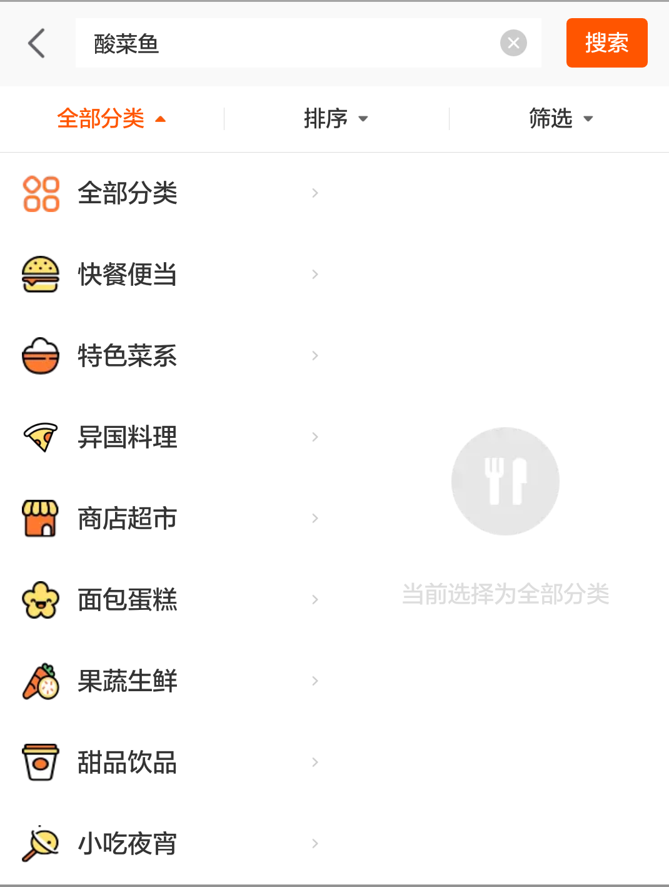
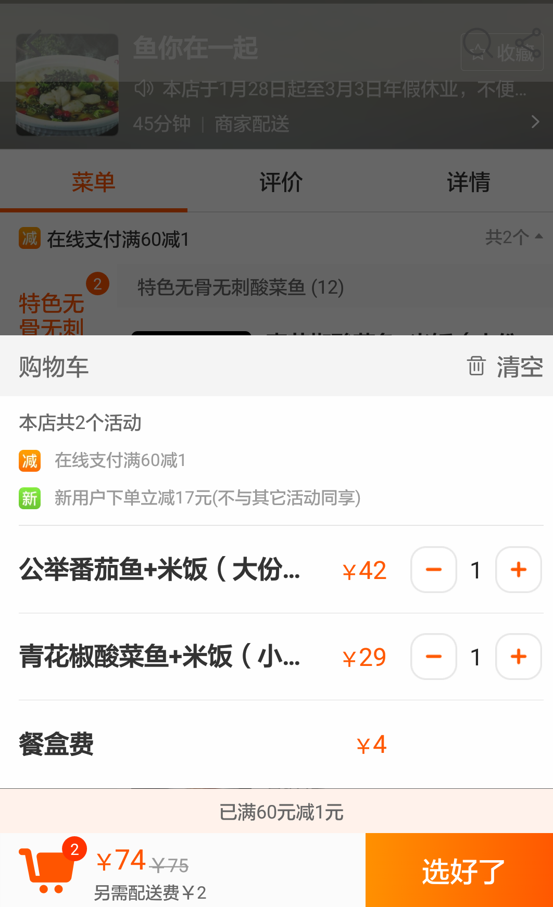

#建模要求
应用名称：淘宝外卖订餐系统
说明：外卖订餐现已越来越受到年轻人们的欢迎。这里以淘宝外卖点餐为例，进行建模。
---

#### *ScreenShot1* 从淘宝应用点击进入淘宝外卖，我们可以在淘宝外卖浏览淘宝外卖的推荐活动及推荐店铺，点击页面上方的搜索栏进行搜索界面

---

#### *ScreenShot2* 在搜索栏输入关键词，点击搜索，可以看到页面显示的搜索结果。包含关键词的店铺名或者是商品名均会显示在该页面。此外，如接下来*ScreenShot3*、*ScreenShot4*、*ScreenShot5*显示，我们可以根据自己的选择定制页面。

---
#### *ScreenShot3* 选择不同的分类方式：
- 全部分类
- 快餐便当
- 特色菜系
- 异国料理商店超市
- 面包蛋糕
- 果蔬生鲜
- 甜品饮品
- 小吃夜宵

---
####*ScreenShot4* 选择不同的排序方式：
- 智能排序
- 距离最近
- 评分最高
- 销量最高
- 起送价最低
- 最早送达

---
####*ScreenShot5* 选择不同的筛选方式：
- 优惠与活动
    - 满减优惠
    - 特价秒杀
    - 赠品优惠
    - 折扣活动
    - 进店领券
    - 下单返券
- 人均消费
    - ￥ 20以下
    - ￥20 ~ ￥40
    - ￥40以上
- 权益与属性
    - 蜂鸟配送
    - 准时达
    - 开发票
    - 品牌商家
    - 新店尝鲜

---

####*ScreenShot6* 选择店铺，点击进入查看店铺详细商品。选择商品添加进购物车。确认无误后，选择“选好了”进入下一步。

---

####*ScreenShot7* 进入结算页面后，填写收货信息及送达时间。
收货信息包括：
- 收货人姓名
- 收货人电话
- 收货人地址
送达时间可以选择：
- 尽快送达（由商家安排尽快送达）
- 其他时间送达（由用户自由选择）
确认外卖送餐信息无误后，点击“确认付款”。淘宝外卖默认选择支付宝付款。付款成功后，用户成功提交外卖订单。
